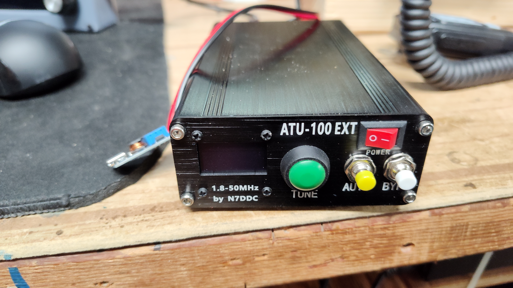

# QRP Radio investigation

I am working on my general license, and have begun getting ready to work HF bands. I wanted to start cheap, but I also wanted what a software controlled radio offers. 

## HF Signals ZBitX Radio
A Ham friend of mine from California suggested checking out https://www.hfsignals.com.

After reviewing their offerings, I selected the ZBitX QRP radio at $160. With tax and shipping, it ends up under $200 delivered. These are assembled in India, so lead time is 4-5 weeks for delivery.

This radio operates on a 64-bit Raspberry Pi Zero 2W, which means it has a full working computer along with the radio, so it has a full touch screen interface, and other cool stuff baked in. It supports AM, USB, LSB, FT8, CW, CWR, digital, 2tone, etc. Because it has a computer baked in, it also supports contact logging, and it can translate CW, and can automate CW send/receive.

The ZBitX operates on 2 3.7V batteries, or a 6-9v input. After watching [this video](https://www.youtube.com/watch?v=FOGDhLEcxUE), battery choice is important. Recommend only brand name batteries.

An excellent tour of the radio's capabilities can be found in this [video](https://www.youtube.com/watch?v=DQKJzermdqU).

# Tuner - ATU-100
I decided that I wanted to operate across all bands with this, and that a portable tuner would be good. I ended up with the $88 [Malahit ATU-100](https://www.amazon.com/dp/B099ZLVV3V). 

The ATU-100 operates on 12-15 volts input. For field operation, they've included a buck converter that can take a USB-C input and step the voltage up correctly. After soldering a pigtail (they also include one) to the buck converter output, I plugged it into a power supply, and adjusted the buck converter via the set screw to the 12-15 volt input required for the ATU-100. I also found a [3d printable case](https://www.printables.com/model/484423-mt3608-usb-type-c-case) for the buck converter, and placed it in the case. 

# Antenna - 1:9 Balun dipole
For an antenna, for $15, I picked up this [1:9 Balun](https://www.amazon.com/dp/B00R09WHT6), and for $10 some [Amazon Basics 100ft speaker wire](https://www.amazon.com/dp/B006LW0W5Y). 

## Bench Operation
I purchased a $10 [9v 3a power supply](https://www.amazon.com/dp/B08L99PTDH) for my bench to operate this in in the shack. 

Some cool features for bench operation: 

1. You can plug in an hdmi cable to the ZBitX (you will need a [mini hdmi to hdmi adapter](https://www.amazon.com/dp/B0F1Y5HRG6)), a mouse and keyboard via USB (you will need a [micro usb adapter](https://www.amazon.com/dp/B0BX9FSCFH)) and you now have access to the raspberry pi OS, and tools that are installed on it, and a larger interface to navigate the radio operation.

2. The ZBitX Raspberry Pi also runs a webserver front end for the UI. When connected to a WiFi router, it offers up the service at https://sbitx.local. This means that you can operate the ZBitX from your bench computer via wifi, with no additional hdmi or usb cables needed.

3. While the ZBitX is a full FT8 station, you can run a usb cable to the ZBitX's CAT port from your shack computer, and you can operate all digital modes that way.

Using the Wifi connection, I turned it on to 20M and listened to FT8 for about 30 minutes. You can see all the signals I received in that time in this picture. Note that the software automatically plots the contact on the map. If the software is set in automatic mode, it will automatically reply to any contact you click on in the list, and include a signal strength report, and then 73, and log the contact in the logbook. 

## Field Operation
You can operate on the touch screen with the provided stylus. In bright light, it can be hard to see, however. Using power via two 18650 flat top batteries - provided the batteries are quality - you can achieve 5w output. The tuner I chose can be powered via the buck converter and with a usb-c power brick. 

I can imagine using a small laptop or tablet in the field, set up a wifi hotspot on the tablet, and then operating the unit from the tablet. I will try this in the future.

## Future improvements
- a better mic input. Currently I grabbed one of [these](https://www.amazon.com/dp/B017SQ8MN0), but I think that I can get something even more portable.
- add a self powered speaker for the output. It can be a little quiet.

## Current thoughts
While it is quite usable, this is very much a hobbyist radio, and the software and hardware spec are continuing to be improved. I think in 12 - 24 months from now, this is going to be a really great device. I'm going to go along for the ride and see where it goes.